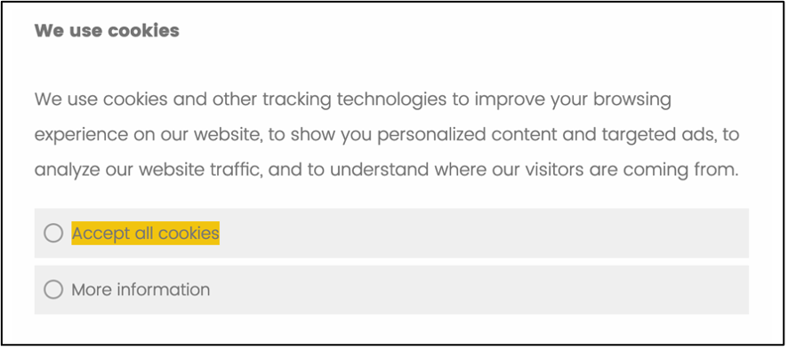
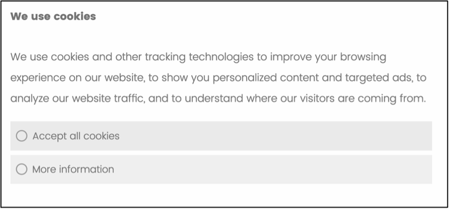
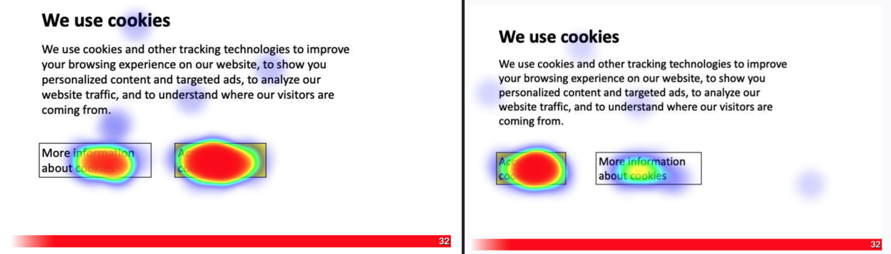

# Introduction

Data is the oil---some say the gold---of our economy. Others claim that "information is the oil of the 21st century, and analytics is the combustion engine."[^1] The metaphors certainly have merit. Data is a resource, and businesses extract value from it. Like oil, data is only valuable if it is in an exploitable form. As refineries convert crude oil into products such as petroleum and gas, raw data needs to be preprocessed before it can be used for analytics.[^2] Business analytics need large amounts of quality data to categorize clusters of customers and predict their behavior. Besides, artificial intelligence (AI) tools allow for automatizing many tasks, such as customer support, and the quality of AI tools improves with user input.

[^1]: [@mavuduru2020]

[^2]: [@mavuduru2020]

While statistical analysis was already a powerful tool for business analytics, today's computing power and data availability have boosted the effectiveness and applicability of data science to business decision making. In fact, computation-intensive machine learning (ML) algorithms can be applied to large data sets with lower processing time. Furthermore, the cost of data storage has gone down, allowing organizations to access large volumes of data that shed light on patterns of profitable business knowledge. ML techniques may benefit both sellers and consumers. Businesses may become more efficient, and some of the efficiency gains may be passed onto the consumers. Furthermore, sellers can understand their consumers better, which enables them to improve their products and services to better satisfy consumer demand.

Businesses, however, face several obstacles to collecting people's data. In fact, there are legal as well as cultural barriers to data collection. Unlike oil, data is not a scarce resource. However, people's privacy is. While information is a public good---meaning that many can exploit the resource at the same time and it is hard to exclude people from its use---and grows exponentially, there are sharp limits to what people feel comfortable sharing. These limits are rooted in people's conceptions about dignity and fairness, as well as utilitarian grounds. In fact, privacy is a human right.[^3] It protects people from interference or intrusion, and controls how someone's information may be used. Oftentimes, infringing someone's privacy causes a blatant pecuniary harm---e.g., when health information is shared with health insurance companies where pre-existing conditions are not covered by insurance plans or mean a higher price.

[^3]: "Privacy is a fundamental human right recognized in the UN Declaration of Human Rights, the International Convenant on Civil and Political Rights and in many other international and regional treaties. Privacy underpins human dignity and other key values such as freedom of association and freedom of speech. It has become one of the most important human rights issues of the modern age." <http://gilc.org/privacy/survey/intro.html>

Although ML has a strong potential to improve the consumers' shopping experience, today businesses also design the environment in which the transactions take place, which leaves room for exploitative nudging. Calo refers to this market feature by which consumers approach the marketplace through technology designed by someone else as the "mediated consumers" phenomenon.[^4] This is because costumers navigate the marketplace through platforms that are designed to exploit our sweet spots and manipulate our behavior. In fact, consumers could eventually discipline marketing tactics by negotiating face to face with the sellers, but this is not how consumers shop in the digital economy. If sellers may discover how to sell more taking advantage of our biases, misperceptions, and imperfect willpower, competitive pressures will lead them to exploit consumers in equilibrium.[^5]

[^4]: @calo2013

[^5]: @akerlof2015

Recent influential privacy regulations have intended to tackle the privacy exploitation problem. However, the main regulatory technique these laws have used is transparency (*i.e.*, disclosure) together with the obligation for firms to obtain the consumer's consent to collect, process, and use their data. This work criticizes this view, showing empirically that the choice architecture employed in the disclosure and consent model overlooks how dark patterns manipulate people's behavior, including their clicks that affect cookies collection. The results are based on a survey experiment ran on Amazon Mechanical Turk on June 10, 2021, with 202 participants. The main finding is qualitatively consistent with similar empirical studies that show how small changes in the choice architecture lead many people to accept conditions they would not accept if the choice environment was neutral. Section 1 provides the regulatory context, discussing the market failure that occurs in the privacy domain as well as the strategies the European Union and California have followed. Section 2 summarizes the experimental design. Section 3 presents the main results. Section 4 discusses the results and puts them in context with similar studies. Finally, Section 5 concludes.  

# Privacy Protection and Regulation

## The Concept of Privacy and Privacy Intrusion

The right to privacy is a relatively new idea.[^6] Its boundaries are hard to clarify. In fact, experts usually state that it is the most difficult right to define.[^7] While the concept emerged as a protection against state intrusion of "the sanctity of a man's home and the privacies of life," such right evolved to cover authorship and people's image. [^8] Today, privacy is understood as the right, or ability, to control the sharing or disclosure of certain information about oneself and one's behavior.[^9]

[^6]: @richardson2017, p.2.

[^7]: @tzanou2013a p. 88.

[^8]: @richardson2017

[^9]: <https://choosetoencrypt.com/privacy/what-is-privacy-protection/> In Europe, the term "data protection law" is preferred. While in North America, Australia, and New Zealand, the used nomenclature is "privacy law." A third label, "data privacy law," is increasingly used too. @bygrave2010 p. xxv.

Privacy can be hard to get because we live in a digital world. Two decades ago, internet privacy mostly meant securing the computers' network connection. Today, people use several internet-connected devices daily, and many applications need to access people data to either provide a better consumer experience, a "free" price, or even to work at all. Much of the internet today is being exploited by companies trying to collect people's data for monetization and marketing purposes. Data became much more valuable thanks to the development of powerful and affordable business analytics tools.

AI and ML are mainstream terms which are sometimes used interchangeably. ML "is a branch of AI and computer science which focuses on the use of data and algorithms to imitate the way that humans learn, gradually improving its accuracy."[^10] ML can be supervised or unsupervised. Supervised learning has the goal of predicting the value of an outcome measure based on a number of input measures. Unsupervised learning, in contrast, focuses on describing associations and patterns among a set of input measures.[^11] Prediction is rooted in all business decisions, and ML drives down its cost. In fact, ML can help entrepreneurs and business owners fundamentally change operational models through affordable predictions. Where previous revenue growth may have been costly due to more decisions being required, ML can be applied to help businesses scale with less. Besides, ML can automate routine tasks like security monitoring, auditing, data discovery, and classification or reporting. Statistical analyses not only allow to determine what happened in the past and why, but also to forecast what is going to happen next. ML can predict customer profiles and send them more targeted, personalized messages. The more personalized the marketing message to the individuals is, the more likely it is they will act.

[^10]: <https://www.ibm.com/cloud/learn/machine-learning>

[^11]: @hastie2009 p. xi.

Behavioral science has shown that human decision-making is highly context dependent.[^12] One of the ways how people's decisions can be altered---or manipulated---is through framing effects. For instance, people feel differently about treatments when a doctor discloses a "95% chance of survival" or a "5% chance of death" despite the fact the information is substantially the same.[^13] And people are not only susceptible to the framing of statistical data, but to the design of the choice environment, more generally. Computer scientists refer to user interfaces that can confuse users, make it difficult for them to express their actual preferences, or manipulate users into taking certain actions as "dark patterns."[^14]

[^12]: See, e.g., @kahneman2003.

[^13]: The main reference is @tversky1981a. For applications to hypothetical treatments, see @oconnor1989 and @armstrong2002.

[^14]: @brignull2011

The most common dark patterns are "nagging," "obstruction," "sneaking," "interface interference," and "forced action." *Nagging* refers to the redirections of expected functionality that persists beyond one or more interactions. It often manifests as a repeated intrusion during normal interactions, in which the user's desired task is interrupted by other tasks not directly related to the one the user is focusing on. *Obstruction* consists of making a process more difficult than it needs to be, with the intent of dissuading certain actions. *Sneaking* refers to attempting to hide or delay the disclosure of information that is relevant to the user (e.g., hidden costs). *Interface interference* is a manipulation of the user interference that privileges certain actions over others (e.g., preselection, aesthetic manipulation). *Forced action* consist of requiring the user to perform an action to access a website or a functionality.[^15] A common feature of dark patterns is that they intend to extract user value in favor of shareholder value.[^16] There is plenty of evidence of how website providers manipulate their design to get what they want---and what people would not normally agree to with a neutral design.[^17]

[^15]: @gray2018 p. 534.

[^16]: @gray2018

[^17]: "We also ran a bunch of interesting experiments. When we asked people to "place order" instead of "start my subscription," 9 percent more did so. When we included coupons with the offer, fewer people subscribed than when we told them they could just "Save 50%." For some reason, it seems, people much prefer "deliver to" and "customize your offer" over "choose a destination" or "choose an offer." We also learned a lesson that every retailer ever knows: If you offer a sale, people buy. The question for us is whether those people will renew." Nicholas Thompson, "We Launched a Paywall. It Worked! Mostly.," *Wired*, accessed June 21, 2021, <https://www.wired.com/story/wired-paywall-one-year-later/.>

## The European General Data Protection Regulation ("GDPR")

The GDPR is grounded on the principle of transparency. It also incorporates principles of "privacy by design" and "privacy by default." The former requires data controllers to implement privacy protective measures like pseudonymization and data minimization into the design of products and services. The latter obligates controllers to establish default rules that reduce the risks associated with the unnecessary collection, processing, retention, or dissemination of personal information.

Because of the principle of transparency, the GDPR provides consumers with several rights. Consumers can request that data controllers provide an explanation of what data they are collecting and how they are using it. In addition, consumers can request that data be corrected or erased. Although controllers may share personal data with third parties to fulfill the original purpose of processing, they may not do so for a different purpose unless the consumer consents or the controller uses a new legal basis. Finally, the GDPR requires firms to maintain certain data security practices. Data controllers, for example, must engage in data minimization by collecting only the data necessary to carry out a particular task.

The GDPR sets stricter rules regarding the users' consent:

-   Consent must be "freely given, specific, informed and unambiguous."

-   Requests for consent must be "clearly distinguishable from the other matters" and presented in "clear and plain language."

-   Data subjects can withdraw previously given consent whenever they want and must honor their decision.

-   Children under 13 can only give consent with permission from their parent.

-   Data collectors must keep documentary evidence of consent.[^18]

[^18]: <https://gdpr.eu/what-is-gdpr/>

## Consent and the Limits of Hands-Off Approaches

The European model is to a large extent based on the notion of informational self-determination. This means "the power of the individual to determine for himself the disclosure and use of his data."[^19] The informational self-determination idea comes from German constitutional jurisprudence, which applied the provisions of human dignity and personality rights to require "clearly defined conditions of processing" to ensure "that under the conditions of automatic collection and processing of personal data the individual is not reduced to a mere object of information."[^20] In the books, the idea looks appealing. Consent is a critical element of economic and social transactions. It is both a manifestation of moral autonomy as well as tool to protecting people from engaging in deals that are not good for them.[^21] The rules regarding capacity, misrepresentation, and mistake ensure that voluntary exchange leads to efficient outcomes.

[^19]: @tzanou2013a p. 89.

[^20]: Volkszahlungsurteil, 65 BVerfGE 1, 68--69 (1983).

[^21]: As Cooter and Ulen put it, "Most people look after their own interests better than anyone else would do for them." @cooter2011 p. 342.

The preceding reasoning is, in a nutshell, the liberal theory of contracts that inspires most of western jurisdictions. Consent-based policies have the potential of ensuring that the market provides what people want. This, of course, assumes that consumers are well-informed and that there is competition in the market. From a regulatory perspective, consent-based policies are a solution to the problem of loss of confidence in the potential for institutionalized structures to direct people's lives.[^22]

[^22]: @collins2003 p.95.

What may seem appealing in the books, is, however, impractical in practice. This work has presented in some detail what dark patterns are. They precisely exist because people's clicks are manipulable. Under these conditions, it seems naive to infer consent from clicks. At least the type of consent that protects people from buying overpriced items or doing business with dishonest people. The GDPR defines consent as: "any freely given, specific, informed and unambiguous indication of the data subject's wishes by which he or she, by a statement or by a clear affirmative action, signifies agreement to the processing of personal data relating to him or her."[^23] According to the GDPR, however, "silence, pre-ticked boxes or inactivity should not ... constitute consent."[^24] While pre-ticketed boxes are not regarded as consent, more prominent options within a decision box pass the GDPR test of legality. Both are types of interference intervention dark patterns.

[^23]: GDPR Art. 4(11).

[^24]: GDPR Recital 32.

Despite the GDPR's enactment, it is common to find dark patterns while browsing the internet from Europe. A recurring use of dark patterns is to get the user's consent to collect and process her cookies. Cookies are an essential component of websites.[^25] In fact, many sites require to store people's data to function. For instance, any retailer needs to store what consumers placed on the shopping cart before the user may checkout the products.[^26] Cookies also store people's passwords and remember what sites people have visited in the past, so they can check their browsing history. Nevertheless, cookies allow advertisers to display targeted publicity based on people's browsing behavior---and to sell more valuable data to third parties.

[^25]: An HTTP cookie is a small piece of data stored on the user's computer by the web browser while browsing a website. Cookies were designed to be a reliable mechanism for websites to remember stateful information or to record the user's browsing activity.

[^26]: See, <https://www.privacypolicies.com/blog/cookies/>

# Experimental Design

This study tests the hypothesis that people's decision to accept or reject cookies is a deliberative one. This is the underlying assumption behind the informational self-determination logic. If such a view was right, people's clicking autonomy should not be affected by dark patterns. To this end, I run a survey experiment with a survey questionnaire that simulated the evaluation of a website, including the appearance of a cookies window. Deception was used in this study, followed by a proper debriefing. The participants were informed that they would give their opinion about a website in which they could quote gifts for the 2021 Christmas. This task was not included in the questionnaire, yet it was necessary to tell the respondents they were about to engage in a different task to maximize the chance they would react to the cookies window in a natural way.

The very first question they saw was a cookies consent request. The participants could accept all cookies right away, or ask for more information and select which cookies they would accept (*i.e.*, strictly necessary; functionality; tracking and performance; and targeting and advertising).[^27] There were two versions of the cookies window. One was *neutral*, with no highlighting at all and randomized the order of the two options: "accept all cookies," and "more information." The *treatment condition* was a window with the "accept all cookies" highlighted in yellow and such option was always displayed as the first alternative. Figure \@ref(fig:highlighted) presents the highlighted version of the cookies window. Figure \@ref(fig:neutral) shows the neutral one.

[^27]: They were defined as follows: **Strictly Necessary.** "Cookies related to user account login or other strictly necessary cookies that your website cannot run without." **Functionality.** "Cookies related to user account login or other strictly necessary cookies that your website cannot run without." **Tracking and Performance.** "Cookies that are used by tracking or performance tools, such as Google Analytics or live chat." **Targeting and Advertising.** "Cookies that are used by advertising services, such as Google Ads or any remarketing service."

```{r highlighted, echo=FALSE, fig.cap="Highlighted Condition", out.width = '85%', fig.align="center"}

```

```{r neutral, echo=FALSE, fig.cap="Neutral Condition", out.width = '85%', fig.align="center"}

```

After the cookies window, three different categories of items were displayed: (i) clothes, (ii) books, and (iii) self-care items. One product in each category was the type of things people usually would not want others to know they are interested in (*i.e*., underwear, erotic books, weight-loss pills). The idea behind this choice was to elicit people's privacy concerns after granting consent to share either all or some of their cookies. The participants were informed that they would assess all the products they selected. Next, the questionnaire asked the participant's attitudes regarding their privacy and targeted advertising. Before the debriefing, socio-demographic controls were included in the questionnaire.

The main hypothesis of this work is that, for many people, the decision to accept some or all cookies is influenced by the cookies window design. This means that contextual cues impact the button people click on, which contradicts the traditional economic view that people's privacy preferences are stable.[^28] This work's hypothesis is intuitive and it has been confirmed in somein experiments with different designs to the one used in this study.[^29]

[^28]: See, e.g., @acquisti2005

[^29]: See, e.g., @nouwens2020

In fact, theory suggests that *order* and *salience* effects should influence the decision to accept some or all cookies. The preceding reasoning leads to the following hypothesis:

***H1**. A more prominent option will be clicked on more than a neutral alternative.*

A related hypothesis is that a button's prominence will lead people to click on it faster than in the control group. This follows from the manipulative design employed by the programmers, who can exploit our inattention clicking on a prominent window. Thus,

***H2**. A more prominent option will be clicked on faster than a neutral alternative.*

Those two are the main hypotheses of this work. Nonetheless, it is also expected that most of the participants who demand more information will refuse the collection of optional cookies.

```{r include=FALSE}
library(readr)
df1 <- read_csv("cookies.csv")

```

```{r include=FALSE}
#For plots
source('Theme_Publication.R')

#Clean DF
library(tidyverse)

library(janitor)

df1 <- df1 %>% 
  clean_names() %>% 
  select(-(recorded_date:user_language)) %>% 
  select(-(q22_last_click:q22_click_count)) %>% 
  select(-(q23_last_click:q23_click_count)) %>% 
  select(-random_id, -(start_date:progress))

#Remove first two rows

df1 <- df1 %>% 
  slice(-c(1,2))

# Gen new vars

# Manipulation var

df <- df1 %>% 
  mutate(highlighted = as.factor(ifelse(fl_10_do == "Block5", 1, 0)),
         duration_in_seconds = as.numeric(duration_in_seconds))

# First click
dfclick <- df %>% 
  mutate(first_click = as.numeric(ifelse(!is.na(df$q22_first_click), 
                                         df$q22_first_click, df$q23_first_click)))
         
```

```{r include=FALSE}

#Explore first click

library(psych)

#Filter excessive duration

dfclickfiltered <- dfclick %>% 
  filter(duration_in_seconds < 500,
         first_click > 0) 

  describe(dfclickfiltered$first_click)
  
dfclick %>% 
  ggplot(aes(x=duration_in_seconds)) +
  geom_histogram(color = "black", fill = "darkturquoise") +
  theme_Publication()+
  labs(title = "Completion Time (in seconds)") +
  theme(text = element_text(family = "LM Roman 10"))

```

```{r include=FALSE}
#plots

# Create new vars for analysis

dffinal <- dfclickfiltered %>% 
  mutate(acceptall = ifelse(!is.na(dfclickfiltered$q1_1), dfclickfiltered$q1_1, dfclickfiltered$q1_2),
         acceptallnum = ifelse(acceptall == "Accept all cookies", 1, 0),
         acceptallftr = factor(acceptallnum,
                                      levels = c("0", "1"), 
                                      labels = c("no", "yes")),
         highlightedftr = factor(highlighted, 
                                        levels = c("0", "1"), 
                                        labels = c("no", "yes")))
  
```

# Results

The survey experiment took place on June 10, 2021, almost two weeks after receiving Stanford's IRB approval. This study recruited 202 participants on Amazon Mechanical Turk. The participants were paid \$0.70 for a task that could be completed in less than 4 minutes. The average completion time was 223.7 seconds, the minimum was 43 seconds, and the maximum 1,427 seconds. The surveys completed in more than 500 seconds were not considered in the analysis. The appendix appendix displays the distribution of completion times, which exhibits a discontinuity after 500 seconds---this threshold seems to be a generous one since it is higher than twice the average completion time.

Most of the respondents were male. In fact, only 46 out of 202 participants were female. Many of the sample members reported having a college degree (134). Only 31 participants stated not having a college degree; 9 had a two-year degree, and 28 a graduate degree. The sample was quite balanced among the experimental conditions. However, there was an imbalance with respect to the educational level of the participants for the neutral condition respondents had more extreme educational levels (*i.e.*, no college degree and postgraduate degree) than those in the prominent window condition. Table \@ref(tab:balancetab) in the appendix shows the covariates balance test. This imbalance is accounted for with regression analysis.

## *The prominence of the accept all cookies button led more people to click on it compared to the control group*

The main hypothesis of this study was confirmed. As it is evident in Figure \@ref(fig:mainplot) there was a substantial difference among the experimental conditions with respect to the rate of participants who accepted all the cookies. In the neutral condition 72% of the respondents accepted the cookies right away, and 28% requested more information. In the prominent condition, 90.5% of the participants accepted all the cookies and only 9.5% demanded more information. While theory predicts this effect, the effect size is a difference of almost 20%. In other words, the accept all cookies to more information ratio is roughly 7 to 3 in the neutral condition, and 9 to 1 in the prominent condition. A logistic regression analysis accounting for the experimental conditions' imbalance marginally lowers this effect as shown in Table \ref(tab:regression_models) of the appendix, which also includes a linear probability model to facilitate the interpretation of the coefficients.

\vspace{0.5cm}

```{r include=FALSE}
# Nice Fonts for Plots
library(extrafont)
library(extrafontdb)
library(Cairo)
loadfonts()
```

```{r mainplot, echo=FALSE, fig.align="center", fig.cap="Accept all Cookies per Condition", warning=FALSE, out.width='0.6\\textwidth'}

ggplot(dffinal, aes(x = highlightedftr, 
                    fill = acceptallftr)) +
         geom_bar(alpha = 0.7) +
  theme_Publication() +
  labs(fill = "Accept all Cookies",
       x = "Highlighted") +
  theme(text = element_text(family = "LM Roman 10"))
  

```

```{r include=FALSE}
library(gtsummary)
library(huxtable)

dfcrosstab <- dffinal %>% 
  select(highlightedftr, acceptallftr) %>% 
  rename(highlighted = highlightedftr,
         accept_all = acceptallftr)

crosstab1 <- dfcrosstab %>% 
  tbl_cross() %>% 
  add_p(source_note = TRUE) 
  

```

Table \@ref(tab:crosstab1) displays the same data in a cross-tabulation. A Chi-squared test rejects the hypothesis that there is no relationship between the highlighting of the cookies window and the acceptance of all cookies.

The following heat-maps also confirm the hypothesis that a highlighted option receives more clicks than a neutral one. However, it is important to note that there is an order effect that benefits the option displayed on the left. In fact, when the "more information" option appears on the left, more people tend to click on it compared to the similar highlighting condition with a reverse presentation order, despite the highlighting of the "accept all cookies" option.

```{r hm, echo=FALSE, fig.cap="Highlighting and right positioning", out.width = '100%', fig.align="center"}


```

## *Trend Towards a Faster Click*

The survey questionnaire used for this study allowed measuring how long it took the participants to click on the cookies window. On average, the participants in the treatment group clicked on the cookies window faster than those in the control group. Table \@ref(tab:tabfirstclick) displays the averages of clicking times for each condition. Both groups exhibited a long right tail and peaked around 2 and 3 seconds. The mean difference among the control and the treatment is more than half of a second. This difference is not statistically significant; nevertheless, this result is contingent on the inclusion of outliers. As Table \@ref(tab:tabfirstclick) shows, when filtering out the first clicks that took longer than 20 seconds, the difference is of almost 1.5 seconds and this result is statistically significant at the .5 level despite the small sample size. While this results is unstable, it seems plausible that it would hold with a larger sample size.

```{r firstclick, echo=FALSE, fig.align="center", fig.cap="Accept all Cookies per Condition", warning=FALSE, out.width='0.6\\textwidth'}

ggplot(dfclickfiltered, aes(x=first_click, fill= highlighted)) +
  geom_histogram(position = "identity", 
                 alpha = 0.4,
                 bins = 30) +
  theme_Publication() +
  theme(text = element_text(family = "LM Roman 10"))
```

```{r message=FALSE, include=FALSE}

library(stargazer)
library(xtable)

# DF for table comparing first_click filtering responses
dftabcomp <- dfclickfiltered %>% 
  mutate(first_click20 = ifelse(first_click < 20, first_click, NA),
         first_click40 = ifelse(first_click < 40, first_click, NA)) %>% 
  select(first_click, first_click20, first_click40, highlighted)

#DF for Main Table 
dftable <- dfclickfiltered %>% 
  select(first_click, highlighted)

#Don't forget to specify the statistic with tbl_summary! I was getting some nonsense by default!!!


#Create table with different subsettings with a different package (psych). Same results. GT_Summary output is nicer and quicker

# tabcomp <- describeBy(dftabcomp ~ highlighted, mat = T) %>%
#   select(n, group1, mean, median, sd) %>%
#   slice(-c(7:8)) %>%
#   rename(Highlighting = group1)
library(summarytools)

```

```{r tabfirstclick, echo=FALSE, fig.align='center'}

#datasummary tab did not work. Nicer output. Try again with more time


dftabcomp %>%
  tbl_summary(statistic = list(all_continuous() ~ "{mean} ({sd})"),
              by = highlighted, missing = "no") %>%
  as_hux_table() %>% 
  #add_difference() %>%
  set_caption("First Click in Seconds") %>%
  theme_article() %>%
  set_latex_float("h") %>% 
  theme_plain()
 # add_footnote("footnote")

```

## *Most Survey Participants Who Demanded More Information Rejected the non-Essential Cookies*

Among all the participants, only 32 clicked the "more information" option (17.6%). As a reminder, those who required more information saw four types of cookies they could accept or reject: (i) essential; (ii) functionality; (iii) tracking and performance; and (iv) tracking and advertising. Including the essential category was tricky. The idea behind this was to measure people's knowledge of what cookies are since essential cookies are necessary for websites to operate. Only the rest are optional. As the following table shows, about 33% of the respondents would reject the use of essential or necessary cookies, half of them refused the functionality cookies, and roughly two thirds rejected the more intrusive cookies.

```{r plotcookies, echo=FALSE, warning=FALSE, fig.align="center", fig.cap="Accept Cookies (Different Types)", out.width='0.6\\textwidth'}

#Data to see people's preferences to share their data

dfmoreinfo <- dffinal %>% 
  filter(q1_1 == "More information" | q1_2 == "More information") %>% 
  select(q2_1:q2_4) %>% 
  rename(necessary = q2_1,
         functionality = q2_2,
         tracking = q2_3,
         advertising = q2_4) %>% 
  drop_na()


#DF Long for ggplot
dfmoreinfolong <- dfmoreinfo %>% 
  pivot_longer(cols = everything(),
               names_to = "Cookies") 

#Change factor level for plot

dfmoreinfolong$Cookies<-factor(dfmoreinfolong$Cookies,
                             levels = c("necessary", 
                                        "functionality",
                                        "tracking",
                                        "advertising"))

#Plot
ggplot(data = dfmoreinfolong, aes(x = Cookies, fill = value)) +
  geom_bar(alpha = 0.7) +
  theme_Publication() +
  theme(text = element_text(family = "LM Roman 10"))
 

```

## *Most of the participants ranked an embarrassing product first in at least one category*

The survey participants read they would experiment with a pilot website in which they would quote several types of products. There were three categories of items: (i) clothes; (ii) books; and (iii) self-care items. There was one "embarrassing" product in each category: underwear, erotic books, and weight-loss pills, respectively. The plan was to allow the participants to select only the products they wanted to quote, but for a design problem the question ended as a ranking of priorities. The label depended on the anticipation of personalized advertising. For people browsing from their phones or private computers probably seeing tailored ads about these products is not an issue. However, for people sharing a computer or for whom their screen can be seen by other people, clicking on this type of items may be embarrassing. Seventy one percent of the respondents ranked one of these items first to be quoted. A future version of this study should correct the question design to make sure the item actually measures an intention to quote products.

## *Most Respondents Report a Positive Opinion About Personalized Advertising*

The survey included three questions that intended to measure people's attitudes towards personalized advertising.[^30] The first one asked whether the participants wanted to see personalized advertising related to the survey task; the second asked about personalized advertising more generally; and the third question was more specific asking about browsing behavior data collection to make targeted advertising possible. Surprisingly, most survey participants displayed a positive view about personalized advertising. As Figure \@ref(fig:plotwantperads) shows, more than 120 respondents indicated they definitely or probably would like to receive personalized advertising with respect to the items included in the survey. Around 20 participants expressed a neutral opinion, and roughly 30 a negative one. The same trend is noticeable regarding the respondents' opinion about data collection with the purpose of offering personalized advertising.

[^30]: The questions were the following: (i) Would you like to receive personalized promotions and/or offers regarding the list of items you just marked? (ii) What is your attitude towards receiving personalized promotions and offers based on your browsing behavior? (iii) What is your opinion on collecting information about people's browsing behavior to advertise products people may be more interested in?

```{r include=FALSE}

#Data for plots

dffinal <- dffinal %>% 
  rename(want_pers_ads = q6,
         attitude_pers_ads = q7,
         opinion_collect_info = q8)

# Check 
dffinal %>% 
  group_by(want_pers_ads) %>% 
  count()

# Factors for order

#This is screwing the data... very weird!

dffinal$want_pers_ads <- factor(dffinal$want_pers_ads,
                                        levels = c("Definitely yes",
                                                   "Probably yes",
                                                   "Might or might not",
                                                   "Probably not",
                                                   "Definitely not")) 

```

```{r plotwantperads, echo=FALSE, warning=FALSE, fig.align="center", fig.cap="Want to Receive Personalized Ads", out.width='0.6\\textwidth'}

ggplot(dffinal, aes(x=want_pers_ads)) +
  geom_bar(fill = "darkturquoise",
           alpha = 0.7) +
  theme_Publication() +
  theme(axis.text.x = element_text(angle = 45, vjust = 1, hjust=1)) +
    theme(text = element_text(family = "LM Roman 10"))
```

# Discussion

Louis Brandeis' statement that "sunlight is said to be the best of disinfectants" is well-known in legal academia. It refers to transparency as an effective strategy to protect people from exploitation, corruption, as well as other risks. The self-determination logic relies on transparency as one of its main pillars. This rationale, however, overlooks the power and influence of dark patterns. The main hypothesis of this study was confirmed yet this is not surprising considering a handful of related studies that had shown the influence of dark patterns on people's decision-making. Machuletz and Böhme's study, for instance, tested a similar intervention to the one this paper tested, finding a 400% difference of cookies acceptance among a neutral decision box and another one with highlighted text.[^31] One of the main points of Machuletz and Böhme's study was to measure people's regret after being informed that a deceptive decision window was used. The authors found a small difference (0.3 points on a 10-point scale) which can be attributed to the dark pattern itself.

[^31]: @machuletz2020

Utz et al's empirical study[^32] showed that even very minimal changes in the choice environment---such as positioning a cookies window on the left corner rather than the right corner or the center of the screen---have substantial effects in terms of cookies acceptance rates. Their study is as remarkable as ambitious. With a sample size of more than 4,000 people, they too tested a highlighted condition, which they denote as "nudging." The authors found a higher rate of acceptance in this nudging condition, with an effect size close to 10%---slightly larger for users browsing from a mobile phone. The notable sample size of Utz et al's study gives it an edge for using it as a benchmark for precise effect sizes. This study found a qualitatively similar result, yet, with a sample size close to 200 participants, the effect size was 18%.

[^32]: @utz2019

There is a puzzle in the results this study found. While most of those who demanded more information rejected the non-essential cookies, most survey participants had a very positive view about personalized advertising. Perhaps people anticipate advertising is everywhere on the web, and between seeing random or personalized ads, people tend to prefer the latter. However, the respondents stated they wanted to see personalized ads as part of the survey experiment. There is a chance this finding is influenced by demand effects (the participants may try to infer and do what the researcher is trying to find). Irrespective of this, future research should better analyze this hypothesis because critical normative implications follow from it; and recent competition law cases have assumed that imposing a personalized experience is an abuse against consumers.

A practical point is worth mentioning here. Experiments are not only the gold standard to prove causality in science, but also a practical way for determining whether a law is achieving its intended effects. From the empirical evidence available to date, it is clear that the European model is naïve in relying excessively on people's autonomy as a strategy to discipline markets. The evidence shows that dark patterns are effective at manipulating people's decisions. If neutral designs were considered as benchmarks, it follows that more than 17% of people are agreeing to conditions to which they would not agree otherwise. This experimental paradigm may well serve as a test of legality to determine whether web suppliers were manipulating people's choices. A better law, with a stronger base on behavioral science and empirical evidence, would not focus on a formalistic concept of consent but on a substantive one that also assesses the manipulation of the choice architecture.

# Conclusions

The recent advances in computing power have increased the power and availability of data collection. Consumers face both advantages and costs due to sharing their data. While the GDPR is widely regarded as the strictest privacy law ever passed, at least before the enactment of the California privacy laws, its focus on informational self-determination overlooks how people's clicks can be manipulated by dark patterns. This study contributes to the academic and policy literature by showing how the GDPR model is currently being bypassed. With a sample size of little less than 200 participants, this study found a substantial difference in the cookies acceptance rate of a neutral and a highlighted versions of cookies windows that contained the very same content. The contradictions found regarding people's rejection of non-essential cookies and their preferences for personalized advertising may show that people's knowledge is an important barrier for consent-based policies to be successful. Future research may well delve into determining what the actual user preferences regarding personalized advertising are. Important normative implications follow from those preferences.

\pagebreak

# Appendix

```{r regression_models, include=FALSE, results='asis'}

# DF for Regression Models

cookiesnumeric <- read_csv("cookiesnumeric.csv") %>% 
  clean_names() %>% 
  mutate(highlighted = as.factor(ifelse(fl_10_do == "Block5", 1, 0)),
         acceptall = ifelse(!is.na(q1_1), q1_1, q1_2),
         acceptallnum = ifelse(acceptall == 1, 1, 0)) %>% 
  select(-(recorded_date:user_language),
         -(q22_last_click:q22_click_count),
         -(q23_last_click:q23_click_count),
         -random_id,
         -(start_date:progress)) %>% 
  slice(-c(1,2)) 


dfregs <- cookiesnumeric %>% 
  mutate(gender = as.numeric(q12),
         educ = as.numeric(q13),
         comp_use = as.numeric(q14),
         years_comp = as.numeric(q15)) %>% 
  select(gender, educ, comp_use, years_comp, highlighted, acceptallnum)

library(modelsummary)

```

```{r crosstab1, echo=FALSE, results='asis'}

datasummary_crosstab(acceptall ~ highlighted, 
                     data = dffinal, 
                     title = "Cookies Acceptance by Condition")

```

```{r balancetab, echo=FALSE, results='asis'}
#Balance Tabs

dfbalance <- dfregs %>% 
  select (-acceptallnum) %>% 
  drop_na()

  datasummary_balance(~highlighted, 
                      data = dfbalance,
                    title = "Balance Test",
                    notes = "Zero for Neutral and One for Highlighted") 
  
```

```{r include=FALSE}

# Regression models

modlog <- dfregs %>% 
  drop_na() %>% 
  glm(formula = acceptallnum ~ highlighted + gender + educ + comp_use + years_comp, 
      family = "binomial")

modlin <-dfregs %>% 
  drop_na() %>% 
  lm(formula = acceptallnum ~ highlighted + gender+ educ + comp_use + years_comp)

```

```{r regressionmodels, echo=FALSE, results='asis'}

stargazer(modlog, modlin, 
          type = "latex", 
          header = F, 
          title = "Regression Models Accounting for the Covariates Imbalance")
```

\pagebreak

# References
